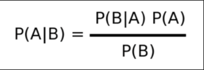
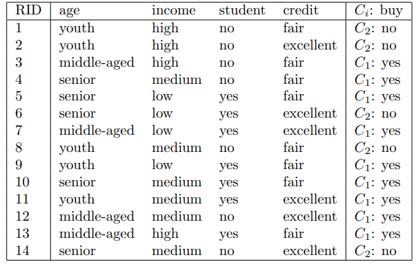
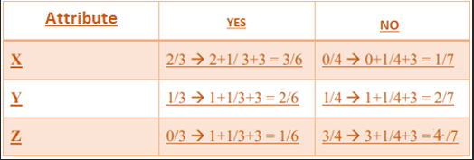

# BLM_0362
Naive Bayes Classification 

# Bayes Teoremi Nedir?

Bayes teoremi, olasılık kuramı içinde incelenen önemli bir konudur. Bu teorem bir rassal değişken için olasılık dağılımı içinde koşullu olasılıklar ile marjinal olasılıklar arasındaki ilişkiyi gösterir. Bu şekli ile Bayes teoremi bütün istatistikçiler için kabul edilir bir ilişkiyi açıklar. Bu kavram için Bayes kuralı veya Bayes savı veya Bayes kanunu adları da kullanılır. Olasılık teorisinde, B ön koşullu A olayı için olasılık değeri, A ön koşullu B olayı için olasılık değerinden farklıdır. Ancak bu olasılık arasında belirli bir ilişki vardır ve bu ilişkiye, ilk açıklayan istatistikçi İngiliz Thomas Bayes'in adına atfen Bayes Teoremi denilmektedir.
Bayes teoremi aşağıdaki denklemle ifade edilir;

P(A|B); B olayı gerçekleştiği durumda A olayının meydana gelme olasılığıdır 
P(B|A); A olayı gerçekleştiği durumda B olayının meydana gelme olasılığıdır 
P(A) ve P(B); A ve B olaylarının önsel olasılıklarıdır.

Burada önsel olasılık Bayes teoreminine öznellik katar. Diğer bir ifadeyle örneğin P(A) henüz elde veri toplanmadan A olayı hakkında sahip olunan bilgidir. Diğer taraftan P(B|A) ardıl olasılıktır çünkü veri toplandıktan sonra, A olayının gerçekleşmiş olduğu durumlarda B olayının gerçekleşme ihtimali hakkında bilgi verir.

# Naive Bayes Sınıflandırıcısı Nedir?

Naive Bayes sınıflandırıcı, örüntü tanıma problemine ilk bakışta oldukça kısıtlayıcı görülen bir önerme ile kullanılabilen olasılıksal bir yaklaşımdır. Bu önerme, örüntü tanımada kullanılacak her bir tanımlayıcı öznitelik ya da parametrenin istatistik açıdan bağımsız olması gerekliliğidir. Her ne kadar bu önerme Naive Bayes sınıflandırıcının kullanım alanını kısıtlasa da istatistik bağımsızlık koşulu esnetilerek kullanıldığında da daha karmaşık yapay sinir ağları gibi metotlarla karşılaştırabilir sonuçlar vermektedir. Bir Naive Bayes sınıflandırıcı, her özniteliğin birbirinden koşulsal bağımsız olduğu ve öğrenilmek istenen kavramın tüm bu özniteliklere koşulsal bağlı olduğu bir Bayes ağı olarak da düşünülebilir. Naive Bayes sınıflandırıcısı Bayes teoreminin bağımsızlık önermesiyle basitleştirilmiş halidir.

Naive Bayes Sınıflandırması Makine öğreniminde denetimli öğrenme alt sınıfındadır. Daha açık bir ifadeyle sınıflandırılması gereken sınıflar(kümeler) ve örnek verilerin hangi sınıflara ait olduğu bellidir. E-posta kutusuna gelen e-postaların spam olarak ayrıştırılması işlemi buna örnek verilebilir. Bu örnekte spam e-posta ve spam olmayan e-posta ayrıştırılacak iki sınıfı temsil eder. Elimizdeki spam ve spam olmayan e-postalardan yaralanarak gelecekte elimize ulaşacak e-postaların spam olup olmadığına karar verecek bir Algoritma da denetimli makine öğrenmesine örnektir. Sınıflandırma işleminde genel olarak elde bir örüntü (pattern) vardır. Buradaki işlem de bu örüntüyü daha önceden tanımlanmış sınıflara sınıflandırmaktır. Her örüntü nicelik (feature ya da parametre) kümesi tarafından temsil edilir.

# Naive Bayes Türleri

**Gaussian Naive Bayes:** Eğer özelliklerimiz sürekli değer (continuous value) ise bu değerlerin bir gauss dağılımı veya diğer bir değişle normal dağılımdan örneklendiğini varsayarak işlem yapılır.
  
**Multinominal Naive Bayes:** Çok sınıflı kategorileri sınıflandırmak için kullanılır. Örneğin bir e-ticaret siteniz varsa pek çok kategoriniz bulunur. (Spor, kozmetik, giyim, petshop)
  
**Bernoulli Naive Bayes:** Multinominal Naive Bayes’e benzer şekilde sınıflandırma yapar. Ancak tahminler sadece ikili(boolean) şeklindedir. Evet/Hayır, Spam/Spam Değil, 1/0, Var/Yok gibi.

# Naive Bayes’in Avantajları

  •	Her özellik birbirinden bağımsız kabul edildiği için   Logistic Regression gibi modellerden daha iyi performans gösterir.
  
  •	Basit ve kolay uygulanabilir.
  
  •	Az veriyle iyi işler başarabilir.
  
  •	Devamlı ve kesik veriler ile kullanılabilir.
  
  •	Yüksek boyutlu verilerde iyi çalışabilir.
  
  •	Hızlı olmasından dolayı gerçek zamanlı sistemlerde kullanılabilir.
  
  •	Alakasız özelliklerle ilişkiye girmemektedir.

# Naive Bayes’in Dezavantajları

  •	Değişkenler arası ilişkiler modellenemez çünkü özellikler birbirinden bağımsız varsayılarak işlemler yapılır.
  
  •	Gerçek hayatta her özellik bir noktada birbirine bağımlıdır.
  
  •	Zero Probability problemi ile karşı karşıya kalınabilir.

# Naive Bayes’in Uygulama Alanları

  •	Gerçek Zamanlı Sistemler
  
  •	Çoklu Sınıflandırma Problemleri (Haber / E-Ticaret Kategorileri)
  
  •	Metin Sınıflandırma (Spam Filtreleme / Duygu Analizi)
  
  •	Hastalık Teşhisi
  
  •	Tavsiye Sistemleri (Recommendation System)

# Naive Bayes Sınıflandırıcısı Örneği

Veri örnekleri yaş (age), gelir (income), öğrenci (student) ve kredi (credit) özelliklerine göre tanımlanır. Sınıf etiketi özniteliği olan buy, kişinin bir bilgisayar satın alıp almadığını söyler, evet (sınıf C1) ve hayır (sınıf C2) olmak üzere iki farklı değeri vardır.

**Sınıflandırmak istediğimiz örnek:**
  
X = (age = youth, income = medium, student = yes, credit = fair)

i = 1, 2 için P(X|Ci)P(Ci)'yi maksimize etmemiz gerekiyor. P(Ci), her sınıfın a priori olasılığı, eğitim örneklerine dayalı olarak tahmin edilebilir:
  
  P(buy = yes) = 9/14 
  
  P(buy = no) = 5/14

i = 1, 2 için P(X|Ci)'yi hesaplamak için aşağıdaki koşullu olasılıkları hesaplıyoruz:
  
  P(age = youth|buy = yes) = 2/9 
  
  P(age = youth|buy = no) = 3/5 
  
  P(income = medium|buy = yes) = 4/9
  
  P(income = medium|buy = no) = 2/5 
  
  P(student = yes|buy = yes) = 6/9
  
  P(student = yes|buy = no) = 1/5 
  
  P(credit = fair|buy = yes) = 6/9 
  
  P(credit = fair|buy = no) = 2/5

Yukarıdaki olasılıkları kullanarak; 
  
P(X|buy = yes) = P(age = youth|buy = yes) x P(income = medium|buy = yes) x P(student = yes|buy = yes) x P(credit = fair|buy = yes) = 2/9 x 4/9 x 6/9 x 6/9 = 0.044

Aynı durumlar için,
  
P(X|buy = no) = 3/5 x 2/5 x 1/5 x 2/5 = 0.019, olarak hesaplanır.

P(X|Ci)P(Ci)'yi maksimize eden sınıfı bulmak için;
  
  P(X|buy = yes) x P(buy = yes) = 0.028
  
  P(X|buy = no) x P(buy = no) = 0.007
  
  0.028 > 0.007 olduğundan Naive Bayes Sınıflandırıcısı X örneği için evet tahmininde bulunur.

# Zero Probability Problemi Nedir?
  
Zero Probability istediğimiz örneğin veri setinde hiç bulunmaması durumudur. Yani herhangi bir işleme sokulduğunda sonucu 0 yapacaktır. Bunun için en basit yöntem tüm verilere minimum değer eklenerek (genellikle 1) bu olasılığı ortadan kaldırmaktır.
  
# Zero Probability Problemi Nasıl Çözülür?  
  

    
  Hem YES olasılığı, hem de NO olasılığına birer gözlem daha eklenir. Böylelikle önsel olasılık;
    
  𝑃(YES) = 3/7 → 3+1 / 7+2 = 4/9
    
  𝑃(NO) = 4/7 → 4+1 / 7+2 = 5/9
    
  Paydaya +2 eklenmesinin sebebi 1 YES olasılığı için, 1 de NO olasılığı için toplamda 2 gözlem eklenmesinden dolayıdır.
    
  Daha sonra ise her bir öznitelik(attribute) için de birer ekleme yapılır. Böylelikle sıfır olan bir olasılık kalmamış olur.

# Kaynakça

- https://cse.engineering.nyu.edu/~mleung/FRE7851/f07/naiveBayesianClassifier.pdf
- https://medium.com/kaveai/naive-bayes-ve-uygulamaları-d7d5a56c689b
- https://tr.wikipedia.org/wiki/Naive_Bayes_sınıflandırıcısı
- https://tr.wikipedia.org/wiki/Bayes_teoremi
